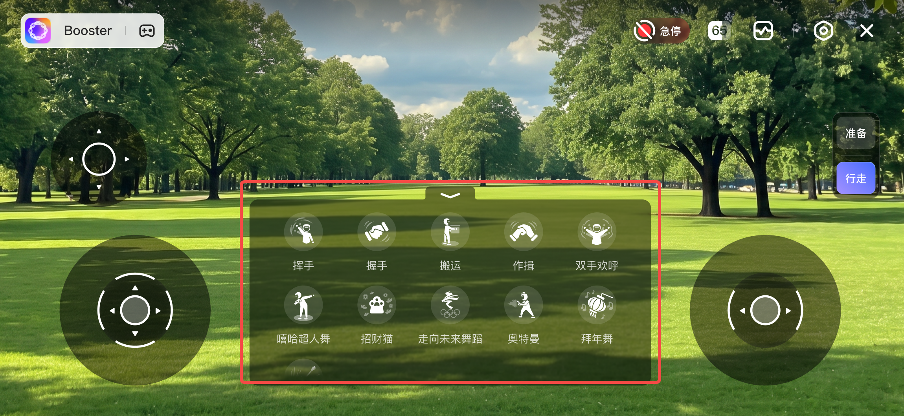

# Booster Agent Python 开发指南 v1\.7

## 引言

### 1\.1\. 什么是Agent

- Agent 运行于机器人端，执行功能并提供按钮、状态、图标等交互内容。App 或 Booster Studio 作为操作端，根据这些信息动态生成界面，用户操作经其发送给 Agent 执行，并实时同步状态变化。

- 从用户的角度来看，不同的 Agent 扮演不同的角色，并能在特定场景中执行任务。例如，启动`Booster`Agent 可使机器人执行挥手、握手等官方功能； 启动 「足球大师」Agent 可使机器人追球、踢球。

- 从编程角度来看，智能体类似于移动应用程序：是一个由一系列文件（可执行程序、数据、资源文件等）组成的包； 当 Agent 运行时，它会启动一个或多个内部进程。在当前的实现中，Agent 直接在机器人的操作系统环境中运行。

- 与传统的 ROS2 应用开发相比，Agent 模式可以降低用户的理解和使用成本，提高应用部署和分发的效率； 对于开发者而言，它还能快速复用 Agent 模式提供的前端 UI 控制能力，使开发者能够专注于核心 Agent 逻辑的开发。


Agent 在 APP 中显示的用户界面如下：


### 1\.2\. 开发框架

我们提供了一个基于 Python 的开发框架，旨在简化为 Booster Robotics 机器人创建交互式 Agent 的过程，其中提供了一套强大的工具，用于：

- **UI组件管理**：轻松创建和管理客户端应用程序中显示的交互式 UI 元素（图标、按钮、状态栏）。

- **输入处理**：统一处理操纵杆/控制器输入，并将其映射到 UI 组件。

- **存储与配置**：用于管理特定于 Agent 的文件和参数的实用工具。

- **国际化**：内置对多语言文本（如英语和中文）的支持。

下图中红框圈出的功能面板内每个按钮都是 UI 组件，开发者可以按需定义其图标样式、文案和功能。




### 1\.3\. 开发环境与工具

推荐使用 [Booster Studio](https://studio.booster.tech/cn/) 作为开发工具，其中预置了完整的开发、运行与调试环境，开箱即用。同时提供标准项目模板，开发者可直接基于模板修改，快速上手，无需从零搭建。

Booster Studio 支持 Windows 10/11、Linux Ubuntu 20\+ 及 Mac Apple Silicon 平台。

如您要在 Booster Robot 真机上运行 Agent，请升级固件版本到 1\.7\.0 及以上。


## 快速上手：6 步构建你的自定义 Agent

### 步骤 1：创建一个 Agent 包

在 Booster Studio 中基于模板创建一个自定义 Agent。


一个最简单的 Agent 项目结构如下：

```Plain Text
example_agent/
├── agent.toml        # 运行配置 (ID、版本、名称 ...)
├── build.toml        # 构建配置 (三方库依赖 ...)
├── src/
│   └── main.py       # Agent 入口代码 (定义组件、回调 ...)
├── res/              # 资源文件 (图标文件 ...)
└── build/            # 构建结果 (构建时自动生成)
    └── xxx.agent     # 最终 Agent 包
```

Agent需要一个继承自`booster_agent_framework.AgentBase`的类作为启动入口。一个简单的没有实际功能的 Agent 代码如下：

```Python
from booster_agent_framework import AgentBase, AgentFeatures

class ExampleAgent(AgentBase):
    def __init__(self) -> None:
        super().__init__(AgentFeatures())
        self.logger.info("init!")
```

### 步骤 2：实现组件逻辑

定义组件被点击时的行为。回调函数返回一个可选的`Toast`（屏幕上显示的短消息），如果不显示消息则返回`None`。

```Python
from booster_agent_framework import Component, LocaleString

def on_wave_click(self, component: Component) -> LocaleString | None:
    self.logger.info("Waving hand!")
    return LocaleString("Waving started", "开始挥手")
```

### 步骤 3：注册组件

初始化您的组件并将它们注册到`ComponentManager`中：

```Python
from booster_agent_framework import DefaultStateIconComponent, LocaleString

def init_components(self) -> None:
    *# Create a "Wave" button*
    *# - ID: "wave_btn"*
    *# - Name: "Wave" (EN/ZH)*
    *# - Callback: on_wave_click*
    wave_btn = DefaultStateIconComponent(
        "wave_btn",
        LocaleString("Wave", "挥手"),
        "res/wave.png",
        False,
        self.on_wave_click,
    )

    *# Update the manager with the component*
    self.component_manager.add_component(wave_btn)
```

也可以使用`ComponentStatePageProxy`托管，根据机器人模式变化自动处理Component的展示切换：

```Python
from booster_agent_framework import (
    ComponentStatePageProxy,
    DefaultStateIconComponent,
    LocaleString,
)

self.page_proxy = ComponentStatePageProxy(self)
self.page_proxy.register_page(
    "Walking",
    lambda page_id, robot_state: robot_state.robot_states_.current_mode == 2 # 2:Walk模式
)

self.wave_component = DefaultStateIconComponent(
    "wave",
    LocaleString("Wave", "挥手"),
    "res/wave.png",
    False,
    self.on_wave_click,
)

self.page_proxy.register_component(
    "Walking",
    self.wave_component,
)
```

### 步骤 4：完善运行配置（`agent.toml`）

更新包中的`agent.toml`文件，以定义 Agent 元数据。系统使用此文件来构建和加载您的 Agent。

一个最小的`agent.toml`示例如下：

```TOML
id = "com.example.my_agent"
version = "1.0.0"
name = { en = "AgentExample", zh = "示例" }
logo = "/res/logo.png"
description = "Example Python Agent"
entry = "src/main.py:ExampleAgent"

[requirements]
min_api_level = 10700
```

如下是`agent.toml`可配置选项的具体信息：

```TOML
# 必填，Agent 唯一 ID。建议使用反向域名格式。
id = "com.example.my_agent"
# 必填，Agent 版本号。用于生成最终 .agent 包名，也会供APP端展示。
version = "1.0.0"
# 必填，Agent 名称。必须至少包含 en。
name = { en = "AgentExample", zh = "示例" }
# 必填，Agent 图标。路径必须指向项目目录内存在的文件。
logo = "/res/logo.png"
# 必填，Agent 描述文本。用于说明 Agent 功能和用途。
description = "Example Python Agent"
# 必填，Python Agent 启动入口，格式为 "python文件路径:类名"。入口类必须继承 booster_agent_framework.AgentBase。
entry = "src/main.py:ExampleAgent"
# 可选，是否允许调试。为 true 且以调试模式启动 Agent 时，会尝试启动 Python debug server。
debuggable = false

# 必填，运行环境要求。
[requirements]
# 必填，此 Agent 兼容的最低系统 API level，使用高于此版本的接口时，开发者应主动通过get_sys_api_level() 来判断运行环境并处理兼容性问题。
min_api_level = 10700
# 可选，支持安装的机器人型号。为空或省略表示不限制。
models = ["Booster T1", "Booster K1"]

# 可选，组件快捷键配置。
[component_shortcuts]
# 可选，快捷键列表版本，当前仅作为元数据记录。
version = "1.0"
# 可选，组件快捷键列表项。每个条目必须包含 id、shortcut、locale_name。
[[component_shortcuts.shortcut_list]]
# [shortcut_list] 存在时必填，快捷键对应的组件ID。
id = "wave"
# [shortcut_list] 存在时必填，快捷键组合。允许 1 到 3 个按键，禁用 BACK、START、LS、RS、["RT", "A"] 等系统保留组合。
shortcut = ["A"]
# [shortcut_list] 存在时必填，快捷键显示名。必须包含 en。
locale_name = { en = "Wave", zh = "挥手" }
```

### 步骤 5：完善构建配置（`build.toml`）

在`build.toml`中配置编译构建的相关依赖信息。

示例：

```TOML
# 可选，目标平台配置。省略 [platform] 时会根据当前构建环境自动选择。
[platform]
# 枚举：sim_x86_64（x86虚拟机器人）、sim_aarch64（ARM虚拟机器人）、real_jetson（配置navdia jeston系列芯片的实体机器人）、real_qcom（配置高通系列芯片的实体机器人）。
supports = ["sim_x86_64", "sim_aarch64", "real_jetson", "real_qcom"]

# 可选，Python 构建配置。
[python]
# 可选，pip 源列表。http/https 作为 index-url 或 extra-index-url；
# dir: 前缀表示项目内本地 wheel 目录，会作为 --find-links 使用。
pip_repos = ["https://pypi.org/simple", "dir:third_party/wheels"]
# 可选，是否混淆 Python 源码。注意：这只是轻量级的混淆。它会降低可读性，但并不能完全保护 Python 源代码不被检查或逆向工程。如果您需要对敏感逻辑进行强保护，则应自行实现更高级的机制。
obfuscation = false

# 可选，按平台安装 Python pip 依赖。
[python.dependencies]
# 可选，所有目标平台共用依赖。支持标准 pip requirement 写法。
common = ["numpy==1.21.5"]
# 可选，仅 sim_x86_64 平台安装的 Python 依赖。
sim_x86_64 = ["numpy==1.21.5"]
# 可选，仅 sim_aarch64 平台安装的 Python 依赖。
sim_aarch64 = ["numpy==1.21.5"]
# 可选，仅 real_jetson 平台安装的 Python 依赖。
real_jetson = ["numpy==1.21.5"]

# 可选，签名配置。省略 [sign] 时，会从环境变量读取 AGENT_SIGN_KEYSTORE 和 AGENT_SIGN_KEYSTORE_PASSWD。
[sign]
# [sign] 存在时必填，签名 keystore 文件路径。也支持 ${ENV:变量名} 引用环境变量。
keystore_path = "${ENV:AGENT_SIGN_KEYSTORE}"
# [sign] 存在时必填，签名 keystore 密码。支持直接写明文，也支持 ${ENV:变量名} 引用环境变量。
keystore_pass = "${ENV:AGENT_SIGN_KEYSTORE_PASSWD}"
```

### 步骤 6：将 Agent 程序安装到机器人上

使用 Booster Studio 可直接一键将您的 Agent 安装到虚拟机器人上，也可使用 build 目录下构建出的 \.agent 文件进行分发安装。


## 框架 API 概述

### booster\_agent\_framework 

`booster_agent_framework`库为开发者提供了一系列关键类，覆盖了从 UI 界面搭建搭建到机器人控制的核心能力。您可以快速获取机器人状态、管理配置，并构建丰富的交互界面。

模块划分如下：

- Agent 基类：应用的基础。用于管理运行配置、响应生命周期回调，并获取各类组件管理器。

- UI 组件系统：构建用户界面。支持声明式组件、动态更新、页面切换和全局 Toast 消息推送。

- 参数系统：处理应用配置。提供参数的读写、校验，并支持参数变更时的回调通知。

- 手柄与快捷键：定义交互方式。用于描述组合键，并提供快捷键元数据的查询能力。

- 机器人状态：访问运行时状态。可获取如机器人当前运行模式等关键信息。

- 存储系统：便捷的本地数据持久化。提供了在 Agent 配置目录下进行文件读写的能力。

- 工具函数：实用辅助功能。包含应用配置读取和系统 API Level 查询等。


详细的API信息，请参考 [Booster Agent Framework Python API](https://booster.feishu.cn/wiki/JoYXwfPB4iTqhLkCJ0ccgSXunyd?renamingWikiNode=false)。


