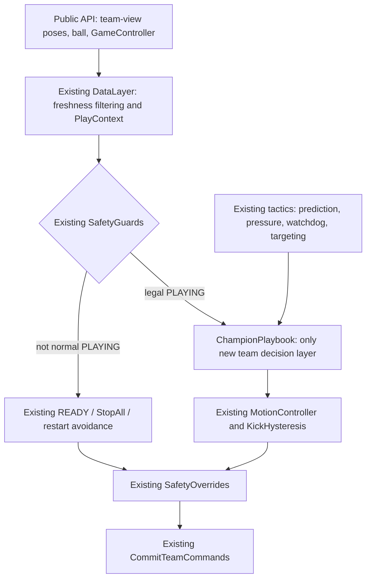

# 冠军策略 V2：基于真实 API 和现有能力的低延迟团队策略

> 状态：策略设计稿，用于指导后续代码接入、回放对比和比赛调参。
> 日期：2026-07-14
> 运行约束：30 Hz，仅 Python 标准库，不使用 PyTorch、NumPy 或其他第三方计算库。

## 1. 策略定位

本策略不重写 `soccer_framework`、行为树、安全层和运动控制器，而是在现有架构上增加一个可回退的 `ChampionPlaybook`。

一句话概括：

> 用现有安全与执行能力保证不犯规，用球轨迹、敌方压力和动作看门狗使每一次处球更早、更快、更少卡死，同时始终保留一名可阻断直接攻门的球员。

目标优先级：

1. 不发出违反 GameController 、罚下、定位球和停止状态的指令。
2. 不因为盲目换人、双人扑球或门将无保护出击而暴露空门。
3. 在敌方压力到来前完成射门、传球或安全解围。
4. 利用球轨迹的短期趋势减少追旧球位和跑过头。
5. 在没有可验证优势时，使用最简单、最易执行的动作。

## 2. 基于真实项目事实的修正

| 旧设想 | 项目事实 | V2 决策 |
| --- | --- | --- |
| 策略内按主客队再次镜像坐标 | `/teamN` 位置已是球队视角，进攻方向始终为 `+x` | 删除策略层二次坐标转换 |
| 新建独立的规则和指令引擎 | 已有 DataLayer、SafetyGuards、SafetyOverrides 和 CommitTeamCommands | 直接复用，不建第二套安全框架 |
| 全部定位球统一 10 s | kick-off 是 10 s，其他定位球是 45 s | 只使用 GameController 状态和 `secondaryTime`，不猜测统一时限 |
| 三台机器人每帧做完整 ETA 联合分配 | 完整 ETA 因启动、绕障和制动数据不足未通过验证 | 仅使用粗到达代价排序，不把它当作精确时间 |
| 球预测直接接管追球 | 预测误差只支持 advisory 使用 | 只使用短期、置信度加权的领先点，始终保留当前球位回退 |
| 永久的全员动态换位 | 门将离门的正确 ETA 和二次保护能力尚未验证 | 常态保留门将身份，仅在危险区或少人时重分配 |
| 将 2.5 m 踢球迟滞进入距离当作控球 | 该距离只是踢球通道迟滞，不代表已经能处球 | AttackWatchdog 从更严格的近球且持续接近条件启动 |

## 3. 不变的架构边界



责任边界：

- `soccer_framework/`：保持为数据和机器人 API 适配层，不放置战术。
- `behavior_tree/`：保留裁判、安全、READY、硬件恢复和指令提交权。
- `tactics/`：保持纯几何、物理、预测、压力和评分能力。
- `play/`：新策略的主要落点，决定角色、候选动作、进攻阶段和风险权重。
- 原始数据和离线分析不成为正式比赛的运行时依赖。

## 4. 30 Hz 的有界计算设计

行为树仍每帧完整 tick，但不同能力使用不同频率：

| 计算 | 频率 | 触发条件 | 计算上界 |
| --- | ---: | --- | --- |
| DataLayer、SafetyGuards、SafetyOverrides | 30 Hz | 每帧 | 现有有界逻辑 |
| 球观测窗口更新 | 最高 30 Hz | 只有新球时间戳 | 最多 30 个样本 |
| AttackWatchdog | 30 Hz | 激活的处球尝试 | 每球员 O(1) |
| 角色和行为候选重评 | 10 Hz | 定时或事件触发 | 最多十余个候选 |
| 敌方压力 | 10 Hz | 球预测或处球目标变化 | 3 名对手×3 s/0.05 s 固定采样 |
| 对手阵型统计 | 2 Hz | 新公开位置 | 只统计 3 名对手 |

立即重评事件：

- GameController 主状态、`stopped`、`setPlay` 或 `kickingTeam` 变化；
- 可用球员集合变化；
- 当前处球者失效、动作完成或 watchdog 触发 escape；
- 球进入本方危险区；
- 球预测因断帧、变向或碰撞重置；
- 压力从安全跨越到紧急阈值。

运行目标：新增策略计算的 p99 低于 5 ms，单帧硬上限 8 ms，为 ROS、行为树和机器人控制保留余量。如果战术重评触达预算，保留上一个仍合法的决策；安全层始终正常运行。

## 5. 队形：稳定门将 + 动态双人组

常态不采用三台机器人任意交换全部角色，而使用更符合已验证能力的结构：

- **Handler**：当前唯一追球和处球者，对应现有 `chaser` 分支。
- **Outlet**：进攻时接应、远侧和二点；防守时封锁第一传球线或中路通道。
- **Cover**：常态由配置的门将承担，使用现有守门和危险区解围能力。

分配规则：

1. 先从 GameController 中排除罚下、替补和已不允许行动的球员。
2. 配置门将有效时，常态保留为 Cover；球进入本方危险区时可以执行门将解围。
3. 剩余两名球员之间动态交换 Handler 和 Outlet。
4. 门将不可用时，从可用球员中选择更靠近本方球门、且不是明确控球者的球员为紧急 Cover。
5. 两人可用时：Handler + Cover；Outlet 缺省。
6. 一人可用时：默认执行 Cover，只在本方危险区处球或解围。
7. 不对无效球员产生普通角色指令，交由 SafetyOverrides 生成最终安全结果。

### 5.1 Handler 选择

完整任意目标 ETA 尚未通过验证，因此 Handler 选择使用“粗到达代价”，只用于排序：

```text
claim_cost
= distance_to_chase_target / 0.716
+ abs(heading_error) / 0.879
+ ready_slot_bias
+ cover_release_penalty
+ role_switch_penalty
```

- `0.716 m/s` 和 `0.879 rad/s` 来自现有巡航与转向回放校准。
- 该分数不宣称是真实到达时间，不用于承诺精确拦截。
- 目标可以是当前球位或置信度加权的短期球轨迹点。
- 新 Handler 必须比当前 Handler 优势明显，或当前 Handler 失效、卡住、距球大幅变远，才允许切换。
- 切换后设置短冷却时间，但裁判、罚下和危险区事件可以立即打断冷却。

## 6. 球轨迹的使用方式

直接复用 `SlidingWindowBallPredictor`，但只作为 advisory。

### 6.1 追球目标

不直接追停球点，也不在第一版求解精确最早相遇点。只计算一个短期领先点：

```text
lead = prediction.position_at(0.20 ~ 0.35 s)
chase_target = current_ball * (1 - w) + lead * w
```

`w` 同时受到以下限制：

- 样本窗口时长；
- 预测置信度；
- 不确定半径；
- 轨迹是否为 `rolling`；
- 领先点是否仍在场内安全区域；
- 球是否处于定位球、裁判摆球或快速方向变化后的重置期。

预测低置信度、对象碰撞、方向突变或长时间断帧时，`w=0`，一帧内回退到当前球位。

### 6.2 其他用途

- Outlet 可使用低权重停球区域调整二点位置。
- Cover 仅当轨迹稳定且指向本方球门时，使用球路与守门线的交点做横向微调。
- 不用球预测决定定位球是否已开放，该事实只信任 GameController。

## 7. 敌方压力驱动的处球

复用 `OpponentPressureEstimator`，将敌方最早可到达时间视为保守上界，不使用对方隐藏意图。

压力分级的初始策略含义：

| 压力级别 | 参考时间 | 允许行为 |
| --- | ---: | --- |
| 立即 | `<= 0.55 s` | 禁止长时间对齐；优先已打开的射门、一触传球或安全解围 |
| 紧迫 | `0.55 ~ 1.20 s` | 只允许小角度调整；无良好射门时传球或向压力较小侧解围 |
| 可处理 | `> 1.20 s` | 允许调整、带球或等待 Outlet 进入接应位 |
| 不可知 | 对手位姿过期 | 按紧迫处理，不伪造精确时间 |

这些阈值是首轮 A/B 参数，不是规则常量，必须通过回放和对局统计调整。

## 8. 处球候选与选择

不再使用“有传球就必然传球，否则射门”的固定顺序。先处理硬场景，其余候选使用同一战术收益含义评分。

### 8.1 硬场景

硬场景不参加普通候选比较：

1. 边线卡球：复用 sideline recovery。
2. 本方球门紧急威胁：门将或 Handler 优先斜向解围，不后场对齐复杂传球。
3. 我方定位球：交由专用事务处理，不进入普通动作切换。
4. 对方定位球：完全交由现有避让和安全分支，不发起普通抢球。

### 8.2 有界候选

每次战术重评最多生成：

- 5 个门内射门目标；
- 最多 2 个合法队友传球目标；
- 3 个带球方向：前、左前、右前；
- 在防守区内附加 3 个解围方向：近侧出界、远侧斜前、中路长距离。

射门、传球、带球和解围各自只保留最优一个，最终只比较 4 个动作类型。

### 8.3 统一评分含义

```text
utility
= execution_margin
+ forward_or_goal_value
+ next_action_readiness
+ opponent_turn_cost
- interception_risk
- own_turn_cost
- post_loss_goal_risk
- action_switch_cost
```

评分依然是可解释的手工函数，不声称是精确进球概率。规则不合法、数据不足或明显无法执行的候选直接淘汰，不通过负分补救。

### 8.4 射门

不再只射球门中心。五个目标均保留球半径和门柱安全余量。评分因素：

- 现有 `lane_clear_score`；
- 球到目标的距离；
- Handler 的转向误差；
- 对方最后一名球员与目标的横向分离；
- 敌方压力是否允许继续对齐；
- 射门被挡后 Cover 和 Outlet 能否控制二点。

若所有射门都低于最低质量，不因为“最好的射门仍然存在”而强制射门。

### 8.5 传球

直接复用合法队友过滤和现有通道分数，但增加：

- 传球线上固定三个位置的敌方可达性检查；
- 接球者的朝向与接球后下一步目标；
- 接球点的敌方压力时间；
- 传球后是否仍保留 Cover。

后场允许横传和小幅回传，前提是它明显解除压力；不再硬性要求每次传球都向前 0.35 m。

### 8.6 带球

带球不使用全场固定中路拉回系数：

- 本方后场：优先向敌人少的边侧移动，避免强制向中路带球；
- 中场：选择保留传球和射门两种后续的方向；
- 前场：选择能打开球门角度的方向；
- 边线附近：只保留具有足够场内分量的候选。

### 8.7 解围

本方危险区内出现以下任一情况，解围优先级显著提升：

- 压力立即或不可知；
- Handler 朝向本方球门或需要大幅转向才能向前；
- 没有通过拦截检查的传球；
- Cover 已经离开球门中心保护区；
- watchdog 判定处球尝试卡住。

首选方向不是固定中路，而是在三个候选中选择敌人更少且不容易形成直接回射的方向。

## 9. AttackWatchdog 作为动作生命周期

直接复用 `AttackWatchdog`，将其视为处球动作的状态和终止信号，而不是另造一套通用租约引擎。

```text
IDLE -> APPROACH -> ALIGN -> EXECUTE
                    \-> ESCAPE
```

启动条件必须比 `soccer_kick_enter_distance=2.5 m` 更严格，至少同时满足：

- 该球员仍是 Handler；
- 球和球员数据有效；
- 球员处于明确的近球处球候选区；
- 目标在短时间内保持稳定，而不是每帧跳变。

终止或重置条件：

- 球已释放；
- 角色变更；
- 裁判或定位球事务变更；
- 球权明显丢失；
- 总超时、阶段超时或长时间没有距离/角度进展。

`should_escape=True` 时不继续原地对齐。逃逸动作的顺序为：

1. 已经打开的快速射门；
2. 压力较小且可达的传球；
3. 向压力较小侧的短推进；
4. 本方危险区中直接解围。

逃逸后使用短冷却，避免下一帧又开始同样的卡死对齐。

## 10. Outlet 和 Cover 的局面化目标

### 10.1 Outlet

| 球的区域 | Outlet 目标 |
| --- | --- |
| 本方后场 | 位于 Handler 的斜前或斜后安全侧，不站在本方球门正前传球线上 |
| 中场 | 与 Handler 形成斜三角，优先站在对手压力较小的一侧 |
| 对方前场 | 远门柱、倒三角或射门后二点区域 |
| 对方持球/我方丢球 | 封锁最危险的中路快速路线，不作为第二名无差别追球者 |

现有 `support_target` 作为安全回退，新候选目标必须通过场内限制、队友间距和路径可执行性检查。

### 10.2 Cover

默认继续使用 `goalkeeper_guard_target`，仅做有边界的增强：

- 球轨迹稳定且指向本方球门时，横向目标可朝预测入门交点偏移；
- 门将只在本方危险区和现有 challenge 条件下处球；
- 门将出击时，Outlet 同帧收紧到球后中路；
- 预测低置信度时立即回到现有守门公式；
- 不根据未验证的完整 ETA 让门将长距离出击。

## 11. 定位球和重启

### 11.1 对方定位球

直接保留现有 opponent restart 分支：

- 使用 1.60 m 缓冲距离；
- 目标点经过半径、球门球禁区和场内约束；
- 球员已在安全距离外时不进行多余移动；
- 只在 GameController 通过 `setPlay` / `kickingTeam` 状态清空表明球权已开放后，恢复普通抢球。

不使用本地倒计时提前抢球，不使用观测到的球移动取代 GameController 的球权状态。当前 `GameControlState` 没有独立的 `ball_free` 字段。

### 11.2 我方 kick-off

kick-off 直接进球需要至少两次稳定触球，因此使用一个跨越 `setPlay` 清空边界的持续事务：

```text
READY_POSITION
-> SET_HOLD
-> FIRST_TOUCH_ACTIVE
-> VERIFY_FIRST_TOUCH
-> SECOND_PLAYER_ACQUIRE
-> SECOND_KICK_ACTIVE
-> VERIFY_SECOND_TOUCH
-> COMPLETE / FALLBACK
```

关键约束：

- 新开球由 READY/SET/kick-off 的事件边沿建立新 `restart_epoch`，不使用每帧时间戳当事务 ID。
- SET 期间依然由安全树全队停止。
- 第一触是小距离推球，第二触由另一名球员完成。
- 第一触完成不只依赖“已发踢球指令”，需结合球位移、球速、踢球员近球和对手距离。
- 第一触后 GameController 可能清空 kick-off 球权标识（例如 `kickingTeam`），但己方开球事务在第二触完成前不退出。
- 第二球员先进入可处球位置，再进入踢球通道，不发一帧的盲目踢球。
- 超时、球路被切断或第二球员未成功获球时，转入普通进攻，不让门将参与补救。

初版保留两个套路：

1. 正向弱第一触 -> 第二人直接打球门开放侧。
2. 横向弱第一触 -> 第二人打远侧。

套路选择只使用近期成功/失败计数和对手开球站位，不引入在线学习库。

### 11.3 其他我方定位球

- **Corner kick**：球门通道开放时直接进攻远门柱，否则向禁区外 Outlet 短传。
- **Throw-in**：向场内 1.5~2.0 m 的安全点，不沿边线继续踢。
- **Goal kick**：优先斜向边路或越过第一道压迫，不在本方球门正面做高风险短传。
- **Direct/indirect free kick**：使用 GameController 提供的类型和球权，保持对方压力门控和 Cover。

除 kick-off 外不自行加入“必须两触”限制。但定位球一触踢入己方球门可导致无效并转为对方角球，因此所有解围目标都必须排除本方球门方向。

## 12. 防守和攻防转换

防守使用“一压迫、一封线、一保门”，但压迫者不是始终盲目抢球。

### 12.1 是否抢球

- Handler 粗到达代价明显优于敌方压力上界：抢球。
- 时间优势不明显：阻断对方直接进攻方向，延缓并逼向边线。
- 敌方已面向本方球门：Outlet 封锁中路下一动，Cover 缩小直接球门角。

### 12.2 丢球后转换

1. 最近 Handler 只在可以立即重新触球时做短反抢。
2. Outlet 立即转为中路封线，不和 Handler 一起盲目扑球。
3. Cover 继续保护球门连线。
4. 短反抢无进展或 watchdog 触发时，Handler 转为延缓和逼边。

## 13. 比分、时间与人数

使用一个连续风险值 `risk in [0, 1]`，不建设大量相互覆盖的比赛模式分支。

输入：

- 比分差；
- `secsRemaining`；
- 己方和对方有效球员数；
- 球所在区域；
- 当前是否拥有处球时间。

`risk` 只调整：

- 射门最低质量；
- 传球允许的拦截余量；
- Outlet 前插程度；
- Handler 丢球后的反抢时间；
- 本方后场解围与带球的权重。

`risk` 不能调整：

- SafetyGuards 和 SafetyOverrides；
- 对方定位球距离；
- SET 和 stopped 的停止要求；
- 罚下球员的可用性；
- Cover 的最低球门保护责任。

人数特殊策略：

- 对方少一人：Outlet 拉开宽度，不和 Handler 重叠。
- 己方少一人：Handler 延缓/解围，Cover 保门，不进行高风险配合。
- 己方只有一人：低位保门和安全解围。

## 14. 长时间无活动规则

M-05 不能依赖原地转向必然解除。在 PLAYING、未 stopped、球距 3 m 内且某名非 Handler 球员长时间没有明显平移时：

- 在不破坏角色站位的前提下，将 Outlet 或 Cover 目标在安全方向上微调 0.20~0.30 m；
- 微调必须经过场内、球门保护和定位球条件检查；
- 一旦进入 SET、stopped 或对方定位球，该活动微调立即取消；
- 默认在距离规则上限足够远的时刻触发，不贴着 10 s 边界赌单帧延迟。

## 15. 对手适应

不引入分类器或黑盒模型，只在 2 Hz 维护三个可由公开位置直接计算的滑动特征：

1. 球周围对手密度；
2. 最后一名对手的平均深度；
3. 对手横向紧凑度。

仅对权重做小幅修正：

- 球周围密度高：提升远侧传球、斜向解围和 Outlet 拉宽。
- 最后一人长期贴近球门：增加远侧射门、二点和倒三角权重。
- 对手横向高度紧凑：提升边侧带球和宽度。

不根据公开位置猜测对手的内部角色、目标或控制指令。

## 16. 能力复用矩阵

| 能力 | V2 使用方式 | 回退 |
| --- | --- | --- |
| PlayContext 新鲜度过滤 | 所有决策的入口事实 | 不在 play 层伪造数据 |
| SafetyGuards / SafetyOverrides | 最高优先级的硬约束 | 不可关闭 |
| ReadyStance / restart avoidance | READY 和对方重启 | 现有默认行为 |
| MotionController | 所有位置目标的执行 | 现有目标跟随 |
| KickHysteresis | 踢球通道进入/退出 | 现有迟滞 |
| Targeting 和 lane score | 候选生成和基础几何分 | 现有 `select_kick_target` |
| SlidingWindowBallPredictor | 短期领先点、二点和门线微调 | 当前球位 |
| OpponentPressureEstimator | 处球时间窗和候选风险 | 按紧迫压力处理 |
| AttackWatchdog | 终止卡死的 approach/align/execute | 现有 chaser 逻辑 |
| 巡航/转向回放参数 | Handler 粗到达代价 | 现有距离分 |
| 完整机器人 ETA | 不采用 | 无 |

## 17. 实施顺序

每个阶段都保留配置开关，关闭后必须回到当前默认策略。

### P0：接入而不改变安全语义

1. 新建 `ChampionPlaybook(DefaultPlaybook)` 并单独注册，不立即替换默认策略。
2. 增加新策略的决策缓存、性能计时和解释日志。
3. 直接复用现有安全、READY、重启避让、MotionController 和 KickHysteresis。
4. 新增少人时的 Cover 重分配，不让被罚门将留下无人保门的角色图。

### P1：三个已验证能力入链

5. 将 SlidingWindowBallPredictor 以配置开关接入 Handler 的短期追球目标。
6. 将 OpponentPressureEstimator 接入处球候选的时间窗。
7. 将 AttackWatchdog 接入 Handler 的 approach/align/execute 阶段。
8. 增加默认逻辑和 V2 的双路调试日志，不立即改变实际指令。

### P2：动作候选与团队协作

9. 实现多点射门、三方向带球和三方向解围。
10. 将传球、射门、带球和解围改为统一选择，保留现有函数作为回退。
11. 将固定 supporter 目标升级为分区 Outlet 目标。
12. 实现 Handler 切换迟滞、门将出击时 Outlet 收紧和 M-05 活动微调。

### P3：定位球和比赛管理

13. 实现持续的两触 kick-off 事务和两个套路。
14. 增加 corner、throw-in、goal-kick 的少量确定套路。
15. 增加连续风险值和三项低频对手阵型统计。

## 18. 验收标准

### 18.1 不可回归项

- 主客队不产生二次坐标镜像。
- `INITIAL/SET/FINISHED/stopped` 的现有 StopAll 语义不变。
- 罚下、倒地和步态恢复仍能最终覆盖普通指令。
- 对方定位球仍保持 1.60 m 缓冲和完整避让约束。
- 球预测、敌方压力或 watchdog 关闭时，完全回到现有逻辑。
- 每台机器人一帧最终只有一个 RobotCommand。

### 18.2 策略指标

- 首次触球时间相比当前球位直追基线下降。
- Handler 无效切换和连续帧抖动明显减少。
- approach/align/execute 超时和无进展次数下降。
- 压力立即时的成功出球率提升。
- 射门通道被堵时的无效射门减少。
- 后场丢球后直接形成空门的次数下降。
- 两触 kick-off 完成率、第二触射门率和超时回退成功率可被独立统计。
- 无新增规则罚下和提前返场。

### 18.3 性能指标

- 控制循环继续稳定运行于 30 Hz。
- 新增战术计算 p99 < 5 ms，单帧新增计算 < 8 ms。
- 候选数量、预测窗口、压力搜索步数和历史容器均有固定上限。
- 超时时复用上一个合法战术结果，不阻塞 SafetyGuards 和指令提交。

## 19. 最终结论

V2 不依靠一个尚未存在的“完美模型”，也不在有限数据上强行做全局预测。它的主要优势来自：

1. 不重建已经正确的安全、运动和指令链路；
2. 第一次把三个已验证但未接入的能力组成完整处球时间窗；
3. 用少量、固定上限的候选替代固定的“传球优先”决策链；
4. 在完整 ETA 尚未通过验证时，不让门将和团队阵型依赖伪精确时间；
5. 所有新能力都有配置开关、低置信度回退和旧逻辑基线。

这是当前项目事实、可用 API、已有验证能力和 30 Hz 纯 Python 约束下，比旧草案更强且更可落地的策略基线。
